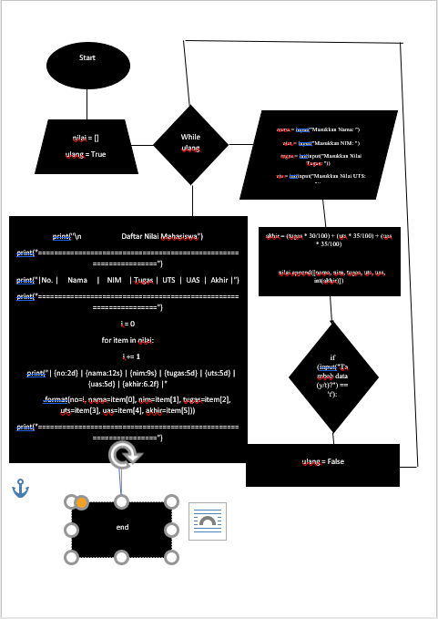

## pertemuan9 
## Nama: Prananda aditya 
## Kelas: TI.20.A.1 
## MATKUL: BAHASA PEMOGRAMAN 
___________________________________________________________________________________\
## Program Data Mahasiswa 
pada praktikum 4 ini, saya akan membuat program sederhana untuk menginput data kedalam list.

## Berikut Inputannya :
nilai = [ ]
ulang = True

While ulang:
 nama = input("Masukkan Nama: ")
    nim = input("Masukkan NIM: ")
    tugas = int(input("Masukkan Nilai Tugas: "))
    uts = int(input("Masukkan Nilai UTS: "))
    uas = int(input("Masukkan Nilai UAS: "))
    akhir = (tugas * 30/100) + (uts * 35/100) + (uas * 35/100)

nilai.append([nama, nim, tugas, uts, uas, int(akhir)])
    if (input("Tambah data (y/t)?") == 't'):
        ulang = False

print("\n                      Daftar Nilai Mahasiswa")
print("==================================================================")
print("|No. |     Nama     |    NIM    | Tugas |  UTS  |  UAS  |  Akhir |")
print("==================================================================")
i = 0
for item in nilai:
    i += 1
    print("| {no:2d} | {nama:12s} | {nim:9s} | {tugas:5d} | {uts:5d} | {uas:5d} | {akhir:6.2f} |"
          .format(no=i, nama=item[0], nim=item[1], tugas=item[2], uts=item[3], uas=item[4], akhir=item[5]))
print("==================================================================")
Setelah Kita memasukan inputan dibawah ini ini lah hasil inputan Tersebut

Dan setelah kita menemukan Hasil nya mari saya jelaskan perinciannya

1.) Langkah Pertama Yang Harus Lakukan adalah kita membuat variable list kosong
nilai = []
ulang = True
Variable ulang = True digunakan untuk mengontrol perulangan.

2.) Setelah itu  kita membuat kondisi perulangan dan statement yang akan dijalankan ketika perulangan terjadi.
    Dan Ini inputannya
    while ulang:
    nama = input("Masukkan Nama: ")
    nim = input("Masukkan NIM: ")
    tugas = int(input("Masukkan Nilai Tugas: "))
    uts = int(input("Masukkan Nilai UTS: "))
    uas = int(input("Masukkan Nilai UTS: "))
    akhir = (tugas * 30/100) + (uts * 35/100) + (uas * 35/100)

    nilai.append([nama, nim, tugas, uts, uas, int(akhir)])
 Dari statement  yang kita masukan diatas, kita akan diminta untuk menginput nama, nim, nilai tugas, nilai uts, dan nilai uas, lalu system akan menjumlahkan nilai-nilai tersebut dan menghasilkan nilai akhir. Setelah menginput berbagai data atau item, inputan item tersebut akan masuk ke dalam list 'nilai'
 3.) Setelah membuat perulangan, kita membuat statement untuk menghentikan atau keluar dari perulangan yang terjadi.

    if (input("Tambah data (y/t)?") == 't'):
        ulang = False
Untuk keluar dari perulangan kita hanya perlu menginputkan 't' apabila diminta pada saat program dijalankan. 't' akan membuat variable ulang = True menjadi ulang = False yang mana akan menghentikan perulangan yang terjadi.

4.) Terakhir kita akan mencetak hasil dari program yang telah dibuat.

print("\n                      Daftar Nilai Mahasiswa")
print("==================================================================")
print("|No. |     Nama     |    NIM    | Tugas |  UTS  |  UAS  |  Akhir |")
print("==================================================================")
i = 0
for item in nilai:
    i += 1
    print("| {no:2d} | {nama:12s} | {nim:9s} | {tugas:5d} | {uts:5d} | {uas:5d} | {akhir:6.2f} |"
          .format(no=i, nama=item[0], nim=item[1], tugas=item[2], uts=item[3], uas=item[4], akhir=item[5]))
print("==================================================================")
Setelah ini selanjutnya kita akan membuat flowcart Sebagai Berikut

##SEKIAN DARI SAYA TERIMA KASIH##